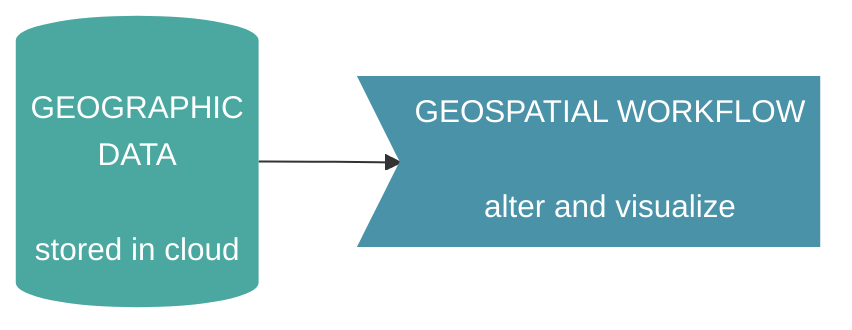
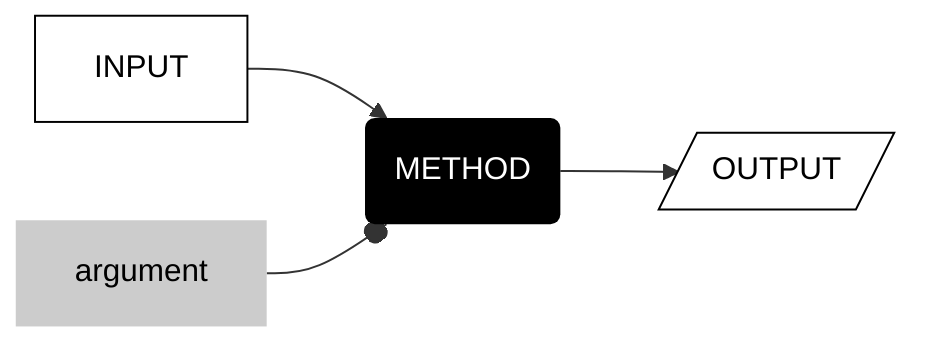
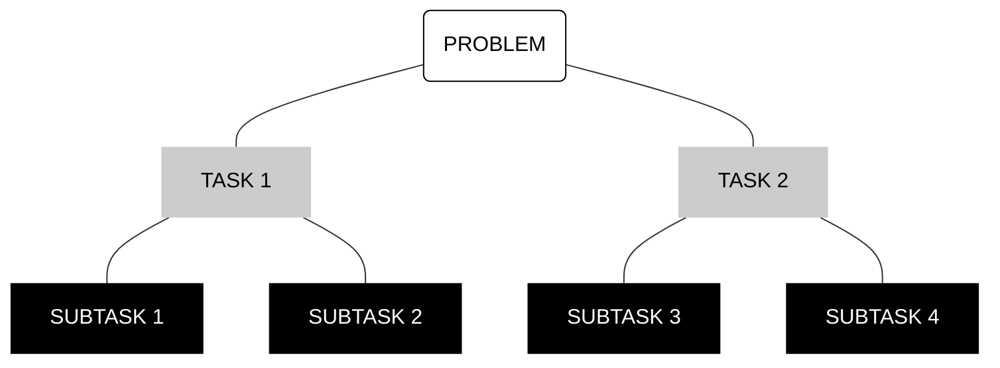
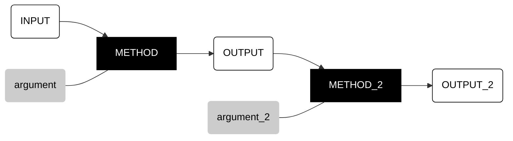

# __introduction__  

This book aims to help you create __geospatial workflows__ with Google Earth Engine.  

In general, these workflows grab geographic data stored in the cloud, alter it (with purpose), and then visualize the results as map layers.  

<center>



</center>

To do this, we will use a web-based Integrated Development Environment (IDE) for the Earth Engine Javascript Application Programming Interface (API). That is a mouthful, but in practical terms it means that __we will create workflows by writing scripts with javascript__.   

## __data transformation__   

The basic element of all geospatial workflows is a three step process that Waldo Tobler called a __cartographic transformation__: you start with geographic data in a certain state (input), you do something to alter the data (method), and you store the result (output). Often but not always, one or more options (arguments) constrain how a method alters the input.   

<center>



</center>

## __statements__

With JavaScript, we transform geographic data by writing a __statement__. The syntax generally takes this form:

```js

var output = input.method(argument);

```

The general pattern is that you start by defining a name for a container that you would like to make so that you can store the output. This container of data is called a __variable__ that you create with the keyword ```var```. You then say that this container will contain ```=``` what results from taking the input and applying a method to it ```.``` with one or more arguments ```()```. A semicolon ```;``` punctuates a statement like a period (or wink :wink:).  

## __task tree__

Workflows are a means to achieving an end. When you sit down to write a workflow, you have some goal state for the data in mind. Your problem is to figure out how to change the data from their original condition to the goal state in your head.  

Most workflows can be decomposed into a __task tree__: at the top, a (big) problem  may be broken down into a sequence of smaller tasks, each of these tasks may be broken down into smaller subtasks.    





</center>


## __task chain__  

The lowest branches of the tree are individual transformations, the foundational elements of a workflow. Higher branches of the tree often require linking together two or more transformations as a __task chain__, where the output of one transformation becomes the input of another. 

<center>



</center>

## __summary__

If this all sounds a bit wonky, do not worry too much. We will get to examples that illustrate all of this soon. For now, I just want you to know:  

1. a workflow is a chain of input-method-output transformations 
2. you can think of a workflow visually (as a flow diagram) and verbally (as javascript).  
3. visually, a workflow contains a vertical hierarchy of purpose (task tree) and a horizontal sequence of transformations (task chains). 

---

<p xmlns:cc="http://creativecommons.org/ns#" >This work is licensed under <a href="https://creativecommons.org/licenses/by-nc-sa/4.0/?ref=chooser-v1" target="_blank" rel="license noopener noreferrer" style="display:inline-block;">CC BY-NC-SA 4.0</a></p>