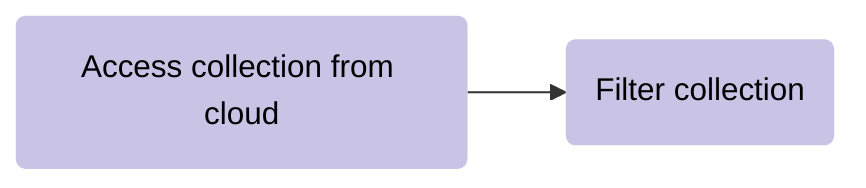
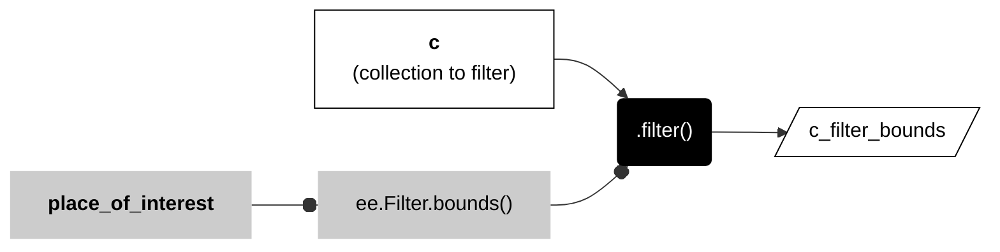

# __filter collections__  

Image and feature collections often include more data than you need. As a result, both tend to follow this pattern: 

<center>



</center>

A filter is a method of asking a true or false question about the content of a collection and then only keeping the records where the answer is true. In other GIS, these are called __selections__ or __queries__ which are often written in SQL, which follows a similar logic but employs a different syntax.  

In Earth Engine, you can filter collections in three ways:  

* by time, 
* by location, 
* by attribute. 

## __filter by time__

_we will get to this in a couple of weeks_  

---  

## __filter by location__  

This involves making spatial comparisons between two layers. One layer is a collection of things (features, images) that has more things than you need. The other layer is a geometry, feature, or feature collection that defines your place of interest. These filters work by comparing the location of things in the first collection with the location of the place of interest in the second layer.   

### __by bounds__  

One of the most common spatial filters tests for __overlap__ between items in the collection and the place of interest. Any item in the collection that overlaps the place of interest will pass through the filter and the rest of the things will be filtered out. Even things that only overlap the place of interest on the very edge will still pass through the filter and remain in the collection. The diagram below shows this by passing items 7, 13, 19 through the filter. You can think of the items in this collection as either individual images (image collection) or individual features (feature collection).   

 


---  

It is sometimes helpful to think of this as a __fork__ filter, because this filter does not alter the shape of the items in the collection. The filter _does not_ cut them, as a knife would, and the collective shape of the items that pass through the filter _does not_ match the shape of the place of interest.  

The syntax for this method in Earth Engine looks a little clunky because you first call ```.filter()``` on the collection that you want to filter (called __c__ for collection in the code snippet), which then takes ```ee.Filter.bounds()``` as an argument, which itself takes the place of interest object as an argument.  



```js
var c_filter_bounds = c.filter(ee.Filter.bounds(place_of_interest));

```

Because this method is very commonly used to filter both image and feature collections but has such wonky syntax, Earth Engine provides an alternative expression to call the method that is a bit simpler to write. In the snippet below, __c__ is the collection to filter and __place_of_interest__ is the object that is being used to test for overlap it. 

```js
var c_filter_bounds = c.filterBounds(place_of_interest);
```

The main advantage of learning to write the first, clunky syntax is that you can use it to include the filter in AND methods (see below).  

---  

### __check results__ 

After applying a filter, it is good practice to quickly check to see if the filter reduced the collection and by how much.    

```js
print(
  "collection before:",
  c.size(),
  "collection after:"
  c_filter_bounds.size()
);
```

---  

### __full pattern__  

Here is the full pattern for filtering by overlap.  

```js
// Filter feature collection for overlap with fork. 

var c_filter_bounds = c.filterBounds(fork);

// Check filtered result.  

print(
  "collection before:",
  c.size(),
  "collection after:"
  c_filter_bounds.size()
);

```

---   

## __:earth_americas: other spatial filters__  

The ```.filterBounds()``` method is a generally fast method to filter by location, but sometimes you may not want to keep features that only overlap the boundary of the place of interest. To help in these cases, I wrote a custom method that allows you to filter features in one collection based on their spatial relationship to features in another collection (place of interest).      

```js

var fc_spatial_filter = geo.fcFilter.spatial('spatialRelationship', collection, place_of_interest);

```

You may choose one of three spatial relationships.  

| SPATIAL RELATIONSHIP  | DESCRIPTION                                                                   |
| --:                   | :--                                                                           |
| "containedIn"         | Returns features in collection that are contained by place of interest.    |
| "disjoint"            | Returns features in collection that do not touch place of interest.        |  
| "intersects"          | Returns features in collection that touch a place of interest.

---  

## __filter by attribute__  

These methods allow you to filter a collection based on __property values__ of items in the collection. For image collections, this means that you can filter based on properties of each image. For feature collections, it means you can filter based on the properties of each feature, which are equivalent to the attribute values of columns in a table.  

### __filter by attribute__ 

```js
var c_filtered = c.filter(
  ee.Filter.eq('property', 'value')
);
```

---  

### __check filter results__  

```js
print(
  "collection before:",
  c.size(),
  "collection after:"
  c_filtered.size()
);

```

---  

### __full pattern__ 

```js
// Filter by attribute  

var c_filtered = c.filter(
  ee.Filter.eq('property', 'value')
);

// Check filtered result.  

print(
  "collection before:",
  c.size(),
  "collection after:"
  c_filtered.size()
);

```

---


## __filter FC by multiple criteria__    

_More soon_

---  

### __AND filter__   

```js
var fc_filter_and = fc.filter(
  ee.Filter.and(
    ee.Filter.eq("property", "value"),
    ee.Filter.eq("property", "value")
  )
);

print(
  "collection before:",
  c.size(),
  "collection after:"
  c_filtered.size()
);
```

---  

<p xmlns:cc="http://creativecommons.org/ns#" >This work is licensed under <a href="https://creativecommons.org/licenses/by-nc-sa/4.0/?ref=chooser-v1" target="_blank" rel="license noopener noreferrer" style="display:inline-block;">CC BY-NC-SA 4.0</a></p>