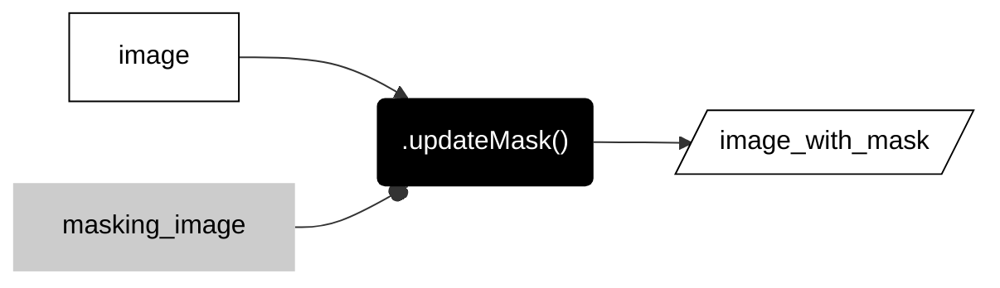
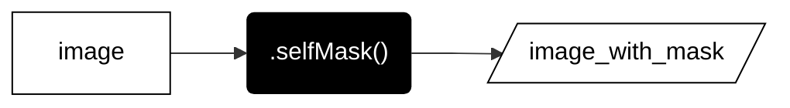

# __local operations__  

These methods compare values at corresponding pixels in two or more rasters. 

_more forthcoming_  

---  

### __mask pixels__  

Masks act like masking tape when you paint. Any pixel with the value 0 in the mask acts like tape and prevents numbers in the output raster from being painted at that location. Masked values will not be displayed with colors when you place the raster layer on a Map. Masked values in an input raster will also be ignored in any subsequent method.    

---  


---  

<center>



</center>

---  

```js

var image_with_mask = image.updateMask(masking_image);

```

---  

### __self mask pixels__  

If you want to ignore pixels that store the value 0 in an image, you can self-mask.  

---  


---  

<center>



</center>

---  

```js

var image_with_mask = image.selfMask();

```

---

<p xmlns:cc="http://creativecommons.org/ns#" >This work is licensed under <a href="https://creativecommons.org/licenses/by-nc-sa/4.0/?ref=chooser-v1" target="_blank" rel="license noopener noreferrer" style="display:inline-block;">CC BY-NC-SA 4.0</a></p>