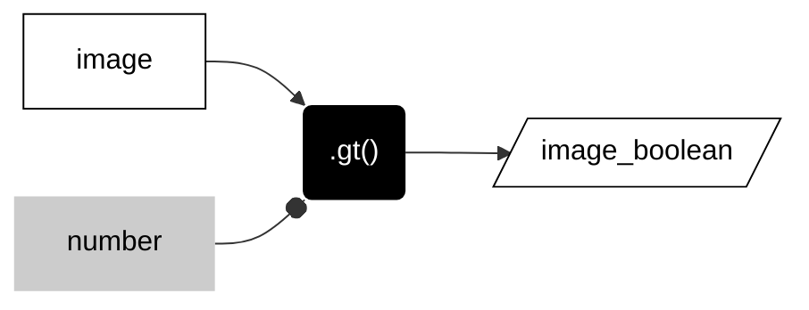
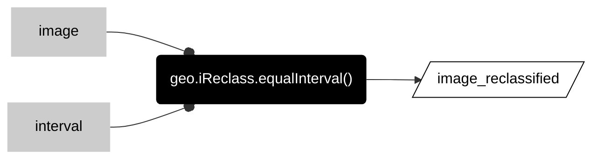
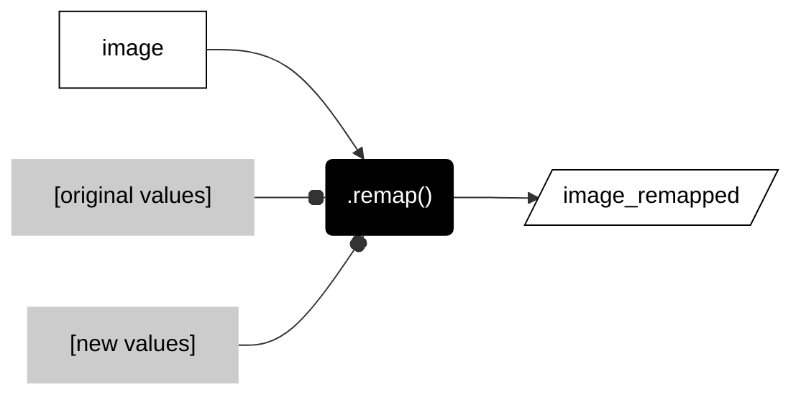

# __reclassify raster__  

These methods purposefully reclassify the values in a raster. 

---  

### __Boolean raster__   

This method asks a true or false question about each value in the input raster and returns a 1 if true and 0 if false in the output raster. Some people call the output a binary raster, but I try to avoid saying the word binary unless necessary. Boolean is descriptive because it means that the result can only have one of two possible values: true or false. 

---  


---  

<center>



</center>

---  

```js
var image_boolean = image.gt(number);  
```

---  

The table below lists some of the common methods to ask true or false questions about a raster. Each takes a number as an argument. Some technical folks will use the verb __threshold__ to describe methods that use greater than or less than methods to produce boolean rasters.  

---  

<center>

| METHOD                        | DESCRIPTION                                             |
| --:                           | :--                                                     |
|```.eq()```, ```.neq()```      | Equal to, not equal to                                  |    
|```.gt()``` ```.gte()```       | Greater than, greater than or equal to                 |   
|```.lt()``` ```.lte()```       | Less than, less than or equal to                 |   

</center>

---  

### __:earth_americas: Reclassify by equal intervals__  

This method assigns raster values into equal interval classes. The method divides each value in a raster by the interval number and then rounds down to the nearest integer (finds the floor). The integers in the output are __ordinal__ but arbitrary class numbers. 

---  


---  

<center>



</center>

---  

```js
var image_reclassified = geo.iReclass.equalInterval(image, interval);
```

---   

### __Remap old values to new values__

This method assigns integer values in the input raster to new integer values in the output raster based on transition rules defined by two lists. The first list defines the set of original values in the input raster. The second list defines the set of new values to be stored in the output raster. The order of the two lists determines the transition. The two lists must be the same length (have the same number of values).

---  


---  

<center>



</center>

---  

```js
var image_remapped = image.remap(
    [0,1,2,3,4],            // Original values
    [1,0,0,0,1]             // New values 
    )                       // Lengths of two lists must be equal.
  ;

```

---  

<p xmlns:cc="http://creativecommons.org/ns#" >This work is licensed under <a href="https://creativecommons.org/licenses/by-nc-sa/4.0/?ref=chooser-v1" target="_blank" rel="license noopener noreferrer" style="display:inline-block;">CC BY-NC-SA 4.0</a></p>