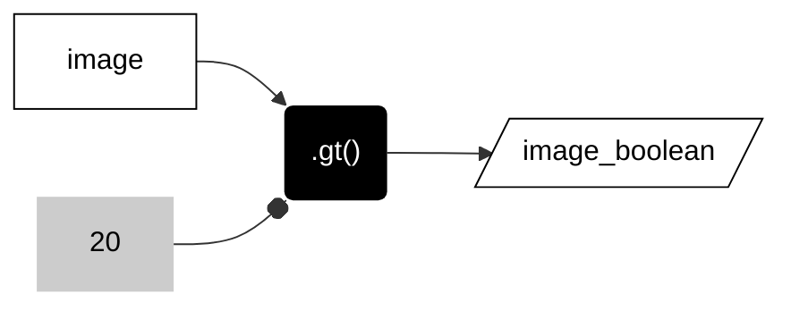
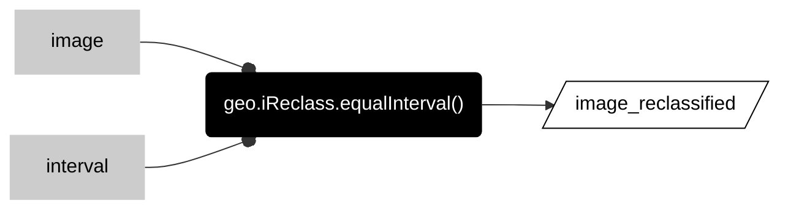
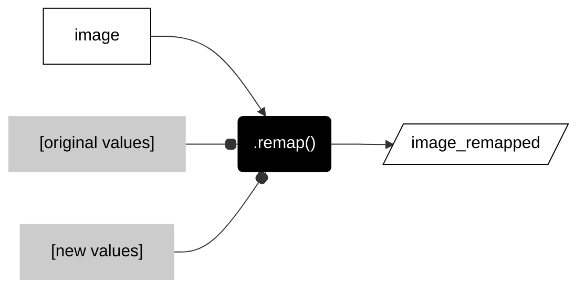

# __reclassify images__  

These methods purposefully reclassify the values in an image. 

_more forthcoming_  

### __Make a boolean (true/false) raster__   


<center>



</center>

```js
var image_boolean = image.gt(20);  
```

The table below lists some of the common methods to ask true or false questions about a raster. Each takes a number as an argument. 

<center>

| METHOD                        | DESCRIPTION                                             |
| --:                           | :--                                                     |
|```.eq()```, ```.neq()```      | Equal to, not equal to                                  |    
|```.gt()``` ```.gte()```       | Greater than, greater than or equal to                 |   
|```.lt()``` ```.lte()```       | Less than, less than or equal to                 |   

</center>

---  

### __:earth_americas: Reclassify by equal intervals__  


<center>



</center>


```js
var image_reclassified = geo.iReclass.equalInterval(image, interval);
```

---   

### __Remap old values to new values__


<center>



</center>

```js
var image_remapped = image.remap(
    [1,2,3,4,5,6,7,8,9,10],            // Original values
    [1,1,2,2,3,3,4,4,5, 5]             // New values
    )
  ;

```

---  

<p xmlns:cc="http://creativecommons.org/ns#" >This work is licensed under <a href="https://creativecommons.org/licenses/by-nc-sa/4.0/?ref=chooser-v1" target="_blank" rel="license noopener noreferrer" style="display:inline-block;">CC BY-NC-SA 4.0</a></p>