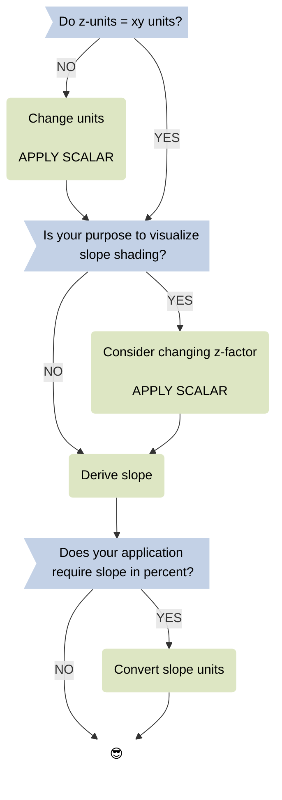
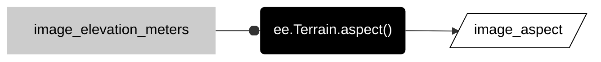
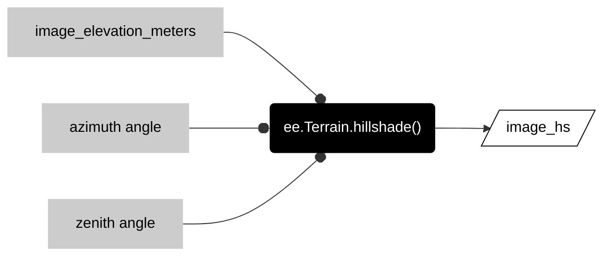

# __terrain__  

These methods derive topographic attributes of terrain from raster elevation data. Before we get too deep into these methods, it is helpful to understand some general concepts about terrain analysis with raster data models.  

## __neighborhood operations__  

Most terrain operations characterize attributes of a surface with a __moving window__, a zone of analysis in the __neighborhood of a focal cell__ that moves systematically across each pixel of a raster.     


The result of each neighborhood calculation is stored in the output raster pixel that corresponds with the location of the focal pixel in the input raster. The shape and size of the moving window is defined by a __kernel__.  The example below uses a square, 3 x 3 pixel kernel to compute the average neighborhood value for a focal pixel.  
  


## __change in elevation__  

### concepts

__Slope__ describes how the vertical dimension of space changes with respect to the  horizontal dimension. Many of us first learn about slope as __"rise over run"__ which can be expressed as a percentage. Most GIS will compute slope as a percentage or in degrees. Earth Engine calculates slope in degrees and then, if you would like to find the percent slope for your application, it leaves it to you to convert from degrees to percentage with scalar operations.  


A raster model will define "run" based on __distance__ between the centers of cells. As a result, the distance between two adjacent cells that share a side will be the same as the length of a pixel side, or the scale of the raster.   


 
In raster analysis, a common slope computation employs a neighborhood operation with a kernel that resembles a "plus" sign. The crosspiece of the plus computes the difference in z-values (elevation) for the x dimension, while the post of the plus computes the difference in z-values for the y dimension. The change in elevation with respect to change in distance can be found by dividing by the distance across the crosspiece or post (which will both be double the cell size). The degree of slope is then found through some trigonometry.


Because the slope calculation directly compares changes in elevation with changes in distance, __the units of the z-values must be the same as the units of the xy values__. In Earth Engine, the xy units will generally be meters. Therefore, accurate slope computations require elevation data in meters.   

### decision flow    

The workflow for slope analysis will often depend on the data you are using and your purpose. I tend to think through some version of the flowchart depicted below. The 

<center>



</center>

### __slope method__

__Derive slope of a surface in degrees from elevation in meters.__  

Call the ```ee.Terrain.slope``` method with the elevation data (with z-units meters) as the argument.  

<center>


</center>

```js
var image_slope = ee.Terrain.slope(image_elevation_meters);

```

---

## __direction of change__  

### __concepts__  

 Closely related to slope, __aspect__ reports the direction of change, or the steepest downhill direction of a pixel. 
 
 Like slope, aspect is derived with a kernel that computes change in elevation in both x- and y- dimensions, but rather than reporting the steepness of the slope, aspect reports the direction, generally expressed as an azimuthal angle from North 0.  

  

### __aspect method__ 

In Earth Engine, the aspect method closely resembles the pattern for slope. 

<center>



</center>

```js
var image_aspect = ee.Terrain.aspect(image_elevation_meters);
```


Because the method directly compares changes in z-values to changes in x- and y- values, the units for elevation must match the units for x- and y- dimensions. Practically, this means the elevation units must be meters.  

The output aspect image reports the direction of slope in degrees. Completely flat pixels (with no slope direction) receive the value 0. It is often good practice to [mask these pixels](../local-operations#mask-pixels) so as not to confuse them with north-facing locations.  

## __analytic hillshading__  

### concepts  

Shaded relief is a method to visualize a three-dimensional surface by creating the illusion of highlights and shadows thrown by sunlight on a terrain. Before computers, cartographers created shaded relief by hand (__manual shaded relief__) in a workflow that blended science and art. Most GIS software now provide a method to automate shaded relief, called __analytic hillshading__, that simplifies the shading illusion. 

The method assumes that the illumination source (sun) is an infinite distance from Earth. As a result, the illumination rays travel and reach the Earth's surface in parallel.  


The angle of the illumination rays depends on the sun's position, which is determined by two coordinates. The solar __azimuth__ angle defines the sun's position on the horizon in degrees from North. It is often most effective to put the illumination source above the northwest horizon, even though in the northern hemisphere it would be unusual to find the sun in this part of the sky. An interesting fact about the illusion of shaded relief is that placing the illumination source in the southern sky will make the landscape appear inverted: mountain ridges look like valleys and creeks look like ridge lines. Because of this, many analytic hillshade tools in GIS will use 315 as the starting solar azimuth angle. You can then adjust this +/- 30 degrees depending on the orientation of ridges and valleys in the area of interest, while taking care not to invert the landscape by pushing the sun too far.  

The second solar coordinate the defines the sun's position above the horizon, or how high the sun hangs in the sky. Many GIS call this the __zenith__ angle, but in Earth Engine it is called __elevation__. If the sun is directly overhead, the zenith angle is 90 and the sun approaches 0 as it nears the horizon. By default, many GIS go with the Goldilocks solution and set the zenith angle at 45. It is often good to start here and then adjust based on your terrain. Lowering the zenith angle can be helpful on flat terrain, while raising the angle can be helpful in more rugged landscapes.       


The brightness of the reflected ray is determined by the __local incidence angle__ from the surface normal (perpendicular to the surface). When the incidence angle is near 0, the rays directly strike the surface and reflect at their brightest power. Because most GIS will store the output of the analytic hillshade method as a byte data type (0-255), the brightest pixels will have the data value 255. In a grayscale palette, this value will be displayed white. As the incidence angle increases, the rays strike the surface obliquely, the brightness values decrease, and the display values change from white to gray. As the angle exceeds 90, the brightness values change from gray to black.


   

### hillshade operation    

In Earth Engine, the ```ee.Terrain.hillshade()``` method takes three arguments to output a hillshade image.  

<center>



</center>


```js
var image_hs = ee.Terrain.hillshade(image_elevation_meters, azimuth, zenith);
```

## __:earth_americas: deviation from mean elevation__  

_Description forthcoming_  

```js
var image_dme = geo.iTerrain.devFromMeanElev(image, 10);

```

---  

<p xmlns:cc="http://creativecommons.org/ns#" >This work is licensed under <a href="https://creativecommons.org/licenses/by-nc-sa/4.0/?ref=chooser-v1" target="_blank" rel="license noopener noreferrer" style="display:inline-block;">CC BY-NC-SA 4.0</a></p>