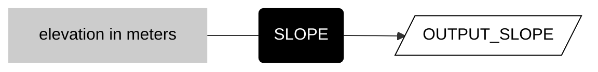
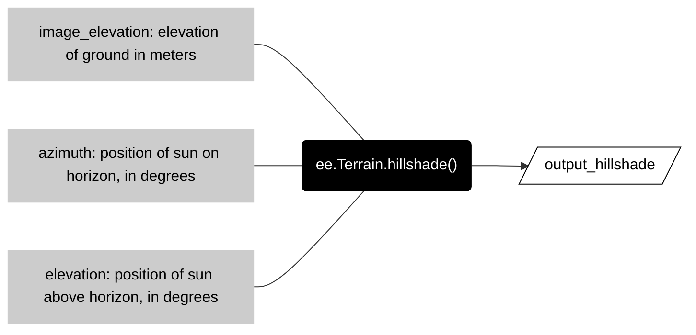

# __terrain__  

These methods derive topographic attributes of terrain from raster elevation data. 

Many terrain methods compare vertical elevation to horizontal distance. For these operations to work correctly, the vertical units (often called __z-units__) need to be the same as the horizontal units (__xy units__). Because horizontal units in Earth Engine are always meters, this means that the general pattern is to first check the z-units of your elevation data and see if you need to scale the values before you call a terrain method. 

<center>


</center>

## __derive slope__

__Derive slope of a surface in degrees from elevation in meters.__  

Call the ```ee.Terrain.slope``` method with the elevation data (with z-units meters) as the argument.  

<center>



</center>

  

```js
var output_slope = ee.Terrain.slope(input_elevation);

```

---

## __derive hillshade__

Shaded relief is a method to visualize a three-dimensional surface through the illusion of sunlight throwing highlights and casting shadows across a rough surface. Before computers, cartographers created shaded relief by hand (__manual shaded relief__) in a workflow that blended science and art. Most GIS software now provide a method to automate shaded relief, called __analytic hillshading__, that simplifies the shading of landscapes by modeling a fixed illumination source from an infinite distance, meaning the rays arrive in parallel from a constant angle defined by a position on the horizon (__azimuth__) and a position above the horizon (__elevation__, or sometimes called __zenith__).    

In Earth Engine, the ```ee.Terrain.hillshade()``` method takes three arguments to output a hillshade image.  

<center>



</center>

An interesting fact about the illusion of shaded relief is that it is often most effective to put the illumination source on the northwest horizon, even though the sun is rarely in this position (in the northern hemisphere). Oddly, if you place the illumination source in the southern sky, the resulting terrain will appear inverted: mountain ridges look like valleys and creeks look like ridge lines.

_more forthcoming_

```js
var image_hs = ee.Terrain.hillshade(image_elevation, 315, 45);
```

## __:earth_americas: deviation from mean elevation__  

_Description forthcoming_  

```js
var image_dme = geo.iTerrain.devFromMeanElev(image, 10);

```

---  

<p xmlns:cc="http://creativecommons.org/ns#" >This work is licensed under <a href="https://creativecommons.org/licenses/by-nc-sa/4.0/?ref=chooser-v1" target="_blank" rel="license noopener noreferrer" style="display:inline-block;">CC BY-NC-SA 4.0</a></p>