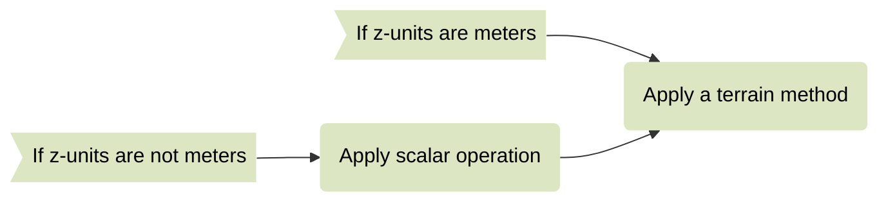
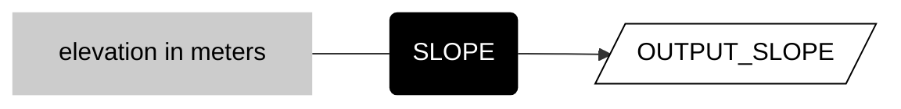

# __terrain__  

These methods derive topographic attributes of terrain from raster elevation data. 

Many terrain methods compare vertical elevation to horizontal distance. For these operations to work correctly, the vertical units (often called __z-units__) need to be the same as the horizontal units (__xy units__). Because horizontal units in Earth Engine are always meters, this means that the general pattern is to first check the z-units of your elevation data and see if you need to scale the values before you call a terrain method. 

<center>



</center>

## __derive slope__

__Derive slope of a surface in degrees from elevation in meters.__  

Call the ```ee.Terrain.slope``` method with the elevation data (with z-units meters) as the argument.  

<center>



</center>

  

```js
var output_slope = ee.Terrain.slope(input_elevation);

```

---

<p xmlns:cc="http://creativecommons.org/ns#" >This work is licensed under <a href="https://creativecommons.org/licenses/by-nc-sa/4.0/?ref=chooser-v1" target="_blank" rel="license noopener noreferrer" style="display:inline-block;">CC BY-NC-SA 4.0</a></p>