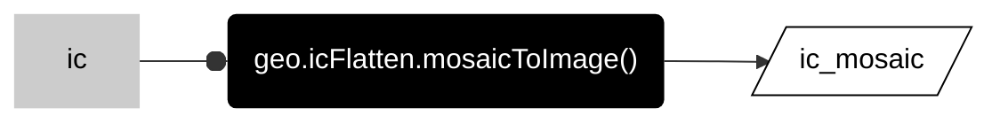

__PATTERNS__

# _**flatten image collections**_

Many workflows for image collections will include a step that transforms an image collection into a single image (and __flattens__ the collection).  

## __composite image__  

If the collection represents a time series of satellite scenes, the workflow will often include a step that makes a __composite image__. This reduces the image collection to a single image.  

Conceptually, composite methods are analogous to local operations for images because they perform calculations for each pixel across a stack of images. The main difference is that the stack of images in a collection can be quite large and not restricted to  comparisons of just two images.  

_diagram forthcoming_  

---  

### __statistical composites__  

These methods calculate a statistic of all values at each pixel across a stack of all matching bands.  

```js
var mean_collection = ic.mean();

print("Composite collection by mean", mean_collection);

```

The example above calculates the mean value in each pixel across the stack of matching bands in the ic. Here are some other common statistical composites. 

```js
var median_collection = ic.median();

print("Composite collection by median", median_collection);

```

```js
var max_collection = ic.max();

print("Composite collection by max", max_collection);

```

```js
var min_collection = ic.min();

print("Composite collection by min", min_collection);

```

```js

// Mode is the most common value at each pixel. 

var mode_collection = ic.mode();

print("Composite collection by mode", mode_collection);

```


---  

## __:earth_americas: mosaic image__ 

If the collection contains a set of small tiles, then a workflow will often include a step that makes a __mosaic image__. This is a common step in workflows with lidar products.  


<center>



</center>

```js
var ic_mosaic = geo.icFlatten.mosaicToImage(ic);

print("Mosaic", ic_mosaic);

```

This method mosaics the tiles into a single image and gives the new image the same coordinate reference system as the first image in the collection. The crs defines the xy units of the image and this enables you to use the mosaic image as an input in terrain operations.  

---

<p xmlns:cc="http://creativecommons.org/ns#" >This work is licensed under <a href="https://creativecommons.org/licenses/by-nc-sa/4.0/?ref=chooser-v1" target="_blank" rel="license noopener noreferrer" style="display:inline-block;">CC BY-NC-SA 4.0</a></p>