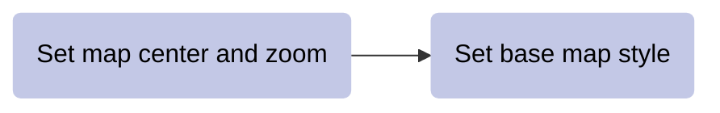

# __customize Map__  

It is often helpful to customize the Map so that it centers and zooms on your area of interest and uses a base map that supports your purpose.  

The diagram below shows a general pattern.

<center>



</center>

It is good practice to set the map center and zoom level before setting the base map so that the base map does not need to redraw.

## __set map center and zoom__  

__Use a data object to center the map and to suggest an appropriate zoom level.__  

```js
Map.centerObject(
    object,             // data object to center the Map. 
    16                  // zoom level to display the Map.
);
```

## __set basemap style__  

__Select a basemap that provides the most helpful reference information from your data.__  

```js
Map.setOptions("HYBRID");
```

Choose from the following options: 

```js
"ROADMAP" 
```
```js   
"SATELLITE" 
```
```js
"HYBRID"
```
```js 
"TERRAIN" 
```

---  

<p xmlns:cc="http://creativecommons.org/ns#" >This work is licensed under <a href="https://creativecommons.org/licenses/by-nc-sa/4.0/?ref=chooser-v1" target="_blank" rel="license noopener noreferrer" style="display:inline-block;">CC BY-NC-SA 4.0</a></p>