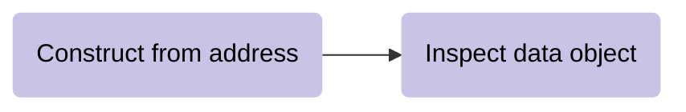
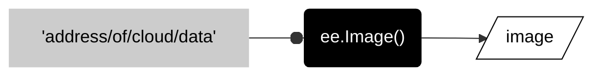
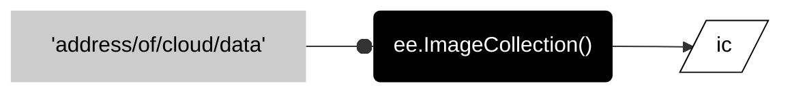

# __gather raster data__  

One of the first things you will usually do with Earth Engine is gather some data from the cloud. Before we get too deep into this, we should review the basic templates for storing geographic data (__geographic data models__) and how they are implemented in Earth Engine.     

---  
## __raster data model__  

A __raster__ stores geographic data with a grid of pixels. Each __pixel__, or cell in the grid, stores a value as a digital number. The __data type__ defines the length of binary numbers used to store the digital number. In the diagram below, the values shown on the left can be stored as a 8 bit unsigned integer, or __byte__, data type shown on the right. 

---  


---  

## __image data object__  

In Earth Engine, the raster model underlies the __image__ data object, where an image is composed of one or more __bands__ and each band is a raster.  

---   


---  

## __accessing images from cloud__  

The diagram below shows a typical pattern for accessing cloud data.

<center>



</center>

The pattern is to first construct the object and then immediately inspect the properties of the object.  

---

### __construct image from address__    

Use the ```ee.Image()``` method to construct an image from the cloud. This method takes the address for the data asset as an argument.   

<center>



</center>

To adapt the snippet below, you will just need to replace ```'address/of/cloud/data'``` with the data address. The address must be a string.  

```js
var image = ee.Image('address/of/cloud/data');
```


---

### __inspect data properties__  

After constructing or altering a data object, I usually want to quickly familiarize myself the properties of the data. To do this, use the ```print()``` method to print the properties of the data object to the Console.  

```js
print(
    "A helpful label",
    image
    )
;
```   

To adapt the snippet below, replace ```"A helpful label"``` with a label that describes the image you are working with. This label must be a string. As necessary, replace ```image``` in the following line with the name of the variable that contains the image data.  

---  

### __full pattern__ 

Here are the two parts of the pattern together.

```js
var image = ee.Image('address/of/cloud/data');

print(
    "A helpful label",
    image
    )
;
```

---  

## __image collection data object__  

In Earth Engine, an image collection is what it sounds like: a collection of images. Earth Engine often uses these raster data objects to store satellite observations, because most satellites observe a region of the earth's surface (often called a __scene__) at a moment in time and then return to this scene at regular intervals to create a __time series__. In these cases, an image collection provides a way to store all the different scenes observed at all the different times by a satellite mission.    

_image forthcoming_  

Image collections are also useful for storing high-resolution rasters as a set of small __tiles__, or images with relatively small geographic extent, that can be stitched together into larger images as needed. For example, Earth Engine will often store Lidar products and high resolution imagery as image collections. 


---  

---  

### __construct from address__  

Use the ```ee.ImageCollection()``` method to construct an image collection from the cloud. The method takes the cloud address as an argument.  

---  

<center>



</center>

Here is the pattern in javascript:

```js
var ic = ee.ImageCollection('address/of/cloud/data');

```

---  

### __inspect data__  

After constructing an ic object, I tend to use a ```print()``` method to learn a couple things about the data.  

```js
print(
    "IC Name",
    ic.size(),          // Consider commenting out this line to make script run faster. 
    ic.first(),
    )
;
```   

The ```ic.size()``` method tells me how many images the collection contains. If the collection is huge, this method can take a while to run, so often I will comment out this line after I have looked at the result to help make the script run faster on subsequent runs. The ```ic.first()``` method tells me some details about the first image in the collection and usually the other images in the collection will have the same band names and property keys.  

### __full pattern__  

Here are the two parts of the pattern together.  


---  

<p xmlns:cc="http://creativecommons.org/ns#" >This work is licensed under <a href="https://creativecommons.org/licenses/by-nc-sa/4.0/?ref=chooser-v1" target="_blank" rel="license noopener noreferrer" style="display:inline-block;">CC BY-NC-SA 4.0</a></p>