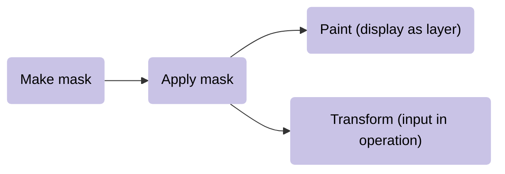
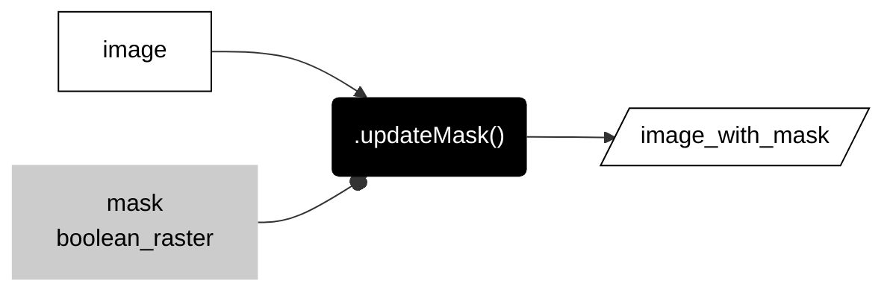
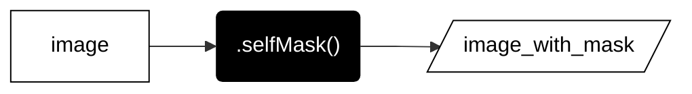
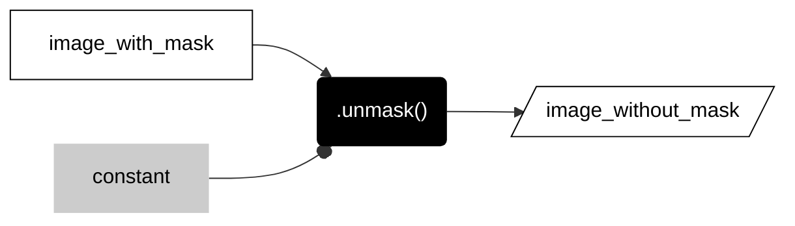

__PATTERNS__

# _**local overlay operations**_  

These methods compare values at corresponding pixels in two or more rasters. 


---  

## __masks__

Masks act like masking tape when you paint. When you mask pixels in a raster before displaying the raster as a map layer, all the pixels with the mask will remain transparent (they will not be displayed with a color). Similarly, when you mask pixels of an input raster in an operation, the masked pixels will be excluded from the computation.  

Typically, workflows with masks involve three steps.    

<center>



</center>

### __mask pixels__  

This pattern uses another raster, typically a [Boolean raster](../reclassify/#boolean-raster) as a mask on another raster. 

Any pixel with the value 0 in the mask acts like masking tape and prevents numbers in the output raster from being painted at that location. Masked values will not be displayed with colors when you place the raster layer on a Map. Masked values in an input raster will also be ignored in any subsequent operation.    


---  

<center>



</center>

---  

```js

var image_with_mask = image.updateMask(boolean_image);

```

---  

### __self mask pixels__   

If you want to ignore pixels that store the value 0 in an raster, you can self-mask. This is not technically a local operation because it only involves one raster, but I wanted to keep the mask operations together. 


---  

<center>



</center>

---  

```js

var image_with_mask = image.selfMask();

```

---  

### __unmask__  

If you are working with a masked image, you can remove the mask and populate all the masked locations with a constant. Again, this is not technically a local operation because it only involves one raster, but I wanted to keep the mask operations together. 


---  

---  

<center>



</center>

---  

```js

var image_without_mask = image_with_mask.unmask();

```

---  

In Earth Engine, ```unmask()``` will replace masked values with 0 by default (This makes the method the inverse of ```selfMask()```. You can include an argument (a number in the parantheses) to specify a different constant.   

---  

## __logical comparisons__  

The diagram below illustrates three common logical comparisons between two regions: A, B. Going from left to right, the first picture shows the two regions. The second picture shows where either region A __or__ region B are present (or true), called the __union__ of the two. The third picture shows where both region A __and__ region B are present, called the __intersection__ of the two. The fourth and final picture shows where region A is present but __not__ region B. In this last case, region B acts like an eraser or __knife__ that cuts out the portion of region A that it touches. Sometimes this last case is called the _difference_ or _subtraction_ of two sets.    


---  

The patterns below describe how each logical comparison shown above can be implemented with raster data models.  

---  

### __union__  


The ```.or()``` method takes two rasters as inputs and kicks out a boolean raster that represents their __union__: pixels in the output raster are true if they are true (not 0) in either raster A or raster B.  


---  

The inputs are commonly __boolean rasters__, as illustrated in the above diagram, but the method will work with nominal (class) data, returning a boolean raster.  


---  

The order of the inputs (which raster is image_A versus image_B) does not really matter. The main thing to remember here is that any masked pixels will be excluded from this operation. So it is good practice to triple-check your inputs to see if you are using a mask on pixels that should be zeros so that you do not inadvertently erase locations that are true in one layer but masked in another.  

```js

var image_union = image_A.or(image_B);

```

### __intersection__


The ```and()``` method takes two rasters as inputs and kicks out a boolean raster that represents their __intersection__: pixels in the output raster are true (not 0) if they are true (not zero) in both raster A and raster B.  


--- 

Like the ```or``` operation, the inputs are commonly __boolean rasters__, but the method will work with nominal (class) data, returning a boolean raster as shown below.  


---  

The order of inputs again does not really matter here. And because this operation is like a __knife__ that cuts and alters the shapes of inputs, this method is less sensitive to masks, unlike the ```or()``` method.

```js

var image_intersection = image_A.and(image_B);

```

---  

### __not__  

In Earth Engine, finding locations that are in raster A but not in raster B is a little tricky. The workflow involves inverting the binary of raster_B and then multiplying it against raster_A.   


---  

```js

var image_A_not_B = image_A.multiply(image_B_inverted_binary);

```

## __map arithmetic__  

As the diagram at the top of this page illustrates, a common type of local overlay operation performs arithmetic operations (addition, subtraction, multiplication, and division) with two rasters.  

---

### __addition__  

The ```.add()``` method performs addition between values in corresponding pixels of two rasters. The order (which raster is A versus B) does not matter. The main thing to remember is that any pixel that is masked will be excluded from the operation (so that output pixel will remain masked).  


---   

```js
var image_A_add_B = image_A.add(image_B);

```

---

### __subtraction__  

The ```.subtract()``` method performs subtraction between values in corresponding pixels of two rasters. The order matters here: you subtract image_B from image_A. Masked pixels in either raster will remain masked in the output.  


```js

var image_A_subtract_B = image_A.subtract(image_B);

```

---

### __multiplication__

The ```.multiply()``` method performs multiplication between values in corresponding pixels of two rasters. The order does not matter here. Masked pixels do matter and will remain masked. 

Multiplication is often used with a boolean raster as a method to __erase__ values in another image, because 0 will convert to 0 and 1 will retain the original value.   


```js

var image_A_subtract_B = image_A.multiply(image_B);

```

--- 

### __division__  

The ```.divide()``` method performs division between values in corresponding pixels of the two rasters. The order does matter here because you divide the values in image_A by the values in image_B. Masked pixels in either image again remain masked in the output.  


```js
var image_A_divide_B = image_A.divide(image_B);

```

## __spectral indices__  

Spectral indices are derived from local operations that compare values in two or more spectral bands. There are many, many different indices. Below I describe two indices that we will use in tutorial 9 and problem 9.  

### __NDVI__    

The normalized difference vegetation index (NDVI) is a measure of the health of vegetation. It is calculated by comparing reflectance of near infrared (NIR) light and red light.  

---

  

---

This takes advantage of the difference in the spectral signatures of healthy versus stressed or dead vegetation; specifically, healthy vegetation will have higher reflectance in the NIR band due to cell structure and lower reflectance in red bands due to absorption by chlorophyll.  

---  


NDVI values will range from -1 to 1. Although results will vary by region, year, and instrument, here are some ballpark numbers to help interpret NDVI values:  

* 0 or less: water 
* 0 - 0.15: impervious surfaces, rock, sand, or snow  
* 0.15 - 0.33: sparse and/or stressed vegetation  
* 0.33 - 0.66: moderatly healthy vegetation
* 0.66 - 1: dense and/or healthy vegetation

---

### __NBR__    

The normalized burn ratio (NBR) is a measure of the severity of a fire. It is calculated by comparing reflectance of near infrared (NIR) and shortwave infrared (SWIR) light. 

  

[_source_](nbr-source){target=_blank}

---  

This takes advantage of differences in the spectral signatures of healthy and burned vegetation.

---  


---

## __awesome spectral indices module__  

Although you can compute most spectral indices from scratch in Earth Engine, I appreciate using a module developed by [Dave Montero Loaiza](https://github.com/davemlz){target=_blank} that is... pretty... awesome.  

Here are the steps for using his module.  

---  

### __load module__  

```js
// ------------------------------------------------------------------------
//  Load spectral indices module.  
// ------------------------------------------------------------------------

var spectral = require("users/dmlmont/spectral:spectral");

print(
  "------------------",
  "SPECTRAL INDICES", 
  "------------------",
  spectral.indices
);

```

---  

### __define parameters__  

This will depend on which data product you are using from the Earth Engine Data catalog and based on [this table](https://github.com/awesome-spectral-indices/awesome-spectral-indices?tab=readme-ov-file#expressions){target=_blank} from Dave's github docs.      

For Landsat 5 or 7 Surface Reflectance, use this pattern:

```js
// ------------------------------------------------------------------------
//  Define parameters for Landsat 5 or 7 Surface Reflectance. 
// ------------------------------------------------------------------------

var parameters = {
    "B": output.select("SR_B1"),
    "G": output.select("SR_B2"),
    "R": output.select("SR_B3"),
    "N": output.select("SR_B4"),
    "S1": output.select("SR_B5"),
    "S2": output.select("SR_B7"),
    "T": output.select("SR_B6")
};

```

---  

For Landsat 8 or 9, use this pattern:

---  

```js
// ------------------------------------------------------------------------
//  Define parameters for Landsat 8 or 0 Surface Reflectance. 
// ------------------------------------------------------------------------

var parameters = {
    "A": output.select("SR_B1"),
    "B": output.select("SR_B2"),
    "G": output.select("SR_B3"),
    "R": output.select("SR_B4"),
    "N": output.select("SR_B5"),
    "S1": output.select("SR_B6"),
    "S2": output.select("SR_B7"),
    "T1": output.select("SR_B10"),
    "T2": output.select("SR_B11")
};

```

---  

### __compute spectral indices__  

You can compute one or more indices with this pattern. This example computes NDVI, NBR, and MNDWI. Each index will be stored as a new band in the output image.  

```js
// ------------------------------------------------------------------------
//  Compute spectral index or indices.
// ------------------------------------------------------------------------

var output_si = spectral.computeIndex(output,["NDVI", "NBR"], parameters);

print(
  "---------------------------",
  "Image with spectral indices",
  "---------------------------",
  output_si);

```


---

[nbr-source]: https://support.climateengine.org/article/123-normalized-burn-ratio

---

<p xmlns:cc="http://creativecommons.org/ns#" >This work is licensed under <a href="https://creativecommons.org/licenses/by-nc-sa/4.0/?ref=chooser-v1" target="_blank" rel="license noopener noreferrer" style="display:inline-block;">CC BY-NC-SA 4.0</a></p>