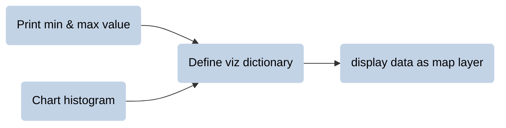

__PATTERNS__

# _**map raster layers**_  

Any geographic information system will provide methods for displaying data as a map layer.  

To understand these patterns, it will be helpful to review some basic concepts of data visualization.  

## __data values vs. display values__  

When you visualize data, you map data values to display values. Two things often happen by default:  

1. The data type of the digital numbers defines the range of values that get mapped to the display values.
2. The relationship between data values and display values is linear.  

---  


---  

The reason that the displayed values in the example above have such poor contrast is a result of the mismatch between the __possible data values__ defined by the data type and the __actual data values__ stored in the raster.  

A __histogram__ is one way to compare the possible and actual data values of a raster. 

---  


---  

A common strategy to improve the contrast of an image is to __stretch__ the display values over the range of actual data values by setting the linear map to begin and end at the minimum and maximum actual data value, respectively. This is usually called __stretch enhancement__.   

---  


---  

## __display image as layer__  

The diagram below shows a general pattern to display an image as a map layer with Earth Engine. The first two tasks -- _print min & max value_ and _chart histogram_ -- are methods to identify the range of actual data values in the image and how they are distributed, respectively. The middle task -- _define viz dictionary_ -- is a method for storing the min and max values for stretch enhancements. The last task -- _display data as map layer_ -- draws the result on the Map.  

<center>



</center>

---  

### __:earth_americas: print min & max value of image__  

Print the min and max data value of a raster image to use as min and max values in viz dictionary.   

```js
var output_min_max = geo.iCart.iMinMax(image, scale, aoi);

print("Min & max value of image", output_min_max);

```

| ARGUMENT              | DESCRIPTION               |
| :--                   |                           |
| __image__           | The name of the variable that contains the image data to process. |
| __scale__                 | The scale of analysis. If possible, use the scale (resolution) of the input image. If this runs really slow (or times out), then increase the scale of analysis by a factor of 2 or more. |  
| __aoi__                | The area of interest or the geographic footprint of the image.|  


---

### __:earth_americas: chart histogram of data values__  

__See how your data are distributed between the minimum and maximum data value by charting a histogram.__

```js
var output_histogram = geo.iCart.iHistogram(image, scale, aoi);

print("Image histogram", output_histogram);

```


| ARGUMENT              | DESCRIPTION               |
| :--                   |                           |
| __input_image__           | The name of the variable that contains the image data to process. |
| __scale__                 | The scale of analysis. If possible, use the scale (resolution) of the input image. If this runs really slow (or times out), then increase the scale of analysis by a factor of 2 or more. |  
| __aoi__                   | An area of interest or the geographic footprint of the image.|  

---  

#### __:earth_americas: histogram for spectral indices__  

Many [__spectral indices__](../patterns/local-operations.md#spectral-indices), particularly normalized difference indices, will output results that range from -1 to 1. However, there are often some pixels that for various reasons lie outside this range in either direction. To chart a histogram for these images, you will need to adapt the pattern above by placing a ```.clamp()``` on the image. 

```js
var output_histogram = geo.iCart.iHistogram(image.clamp(-1, 1), scale, aoi);

print("Image histogram", output_histogram);

```

The clamp method has two arguments (min, max) and redefines the range of values in the image so that they all fall within this range. (For this reason, you will generally see 'bookends' on either side of a histogram charted from a clamped image.)  

---  

#### __:earth_americas: get AOI from Map extent__ 

If you are working with a global dataset or an image that has been flattened from a collection, the chart histogram pattern will likely throw errors and tell you it cannot work on an unbounded image. You can work around this with the helper below from the geo module. It will retrieve an area of interest (AOI) from the current geographic extent of the Map window.  

```js
var aoi = geo.uiMap.getAOIfromMapExtent();
```

---  

#### __:earth_americas: get Nominal scale helper__ 

Sometimes you may be working with an image and realize that you do not know the native image scale. The helper below from the geo module will retrieve the __nominal scale__ of the image. This is the scale at the equator of the image dataset and should be interpreted with some caution, but it can be helpful as a starting point for defining the scale for the ```geo.iCart.iHistogram()``` and ```geo.iCart.iMinMax()``` methods described above.  

```js
var scale = geo.iCart.getNominalScaleFromImage(image);

print("IMAGE SCALE", scale);
```


### __define raster viz dictionary__  

__For raster data, store the viz dictionary as a variable and then call this variable when you add the map layer.__   

Here is a common pattern to visualize __single-band images with grayscale__:


```js

var single_viz = 
    {
        min: [],        
        max: [],        
    }
;

```

---  

Here is a common pattern to visualize __single-band images with color__ (this includes both color gradient layers and nominal layers where a unique color displays each unique class):


```js

var single_viz = 
    {
        min: [],        
        max: [],        
        palette: [],    
    }
;
```

---   

If your image data represents __nominal data__ with integers, you can quickly visualize this data with __random colors__ using the ```.randomVisualizer()``` method on the image and calling an empty dictionary for the viz parameters.    

```js
Map.addLayer(image.randomVisualizer(), {}, "Nominal Classes");
```

This pattern is most useful for quick visualizations, when the color used to display the class does not matter too much. If you want to be able to control which color displays each class, then you should use the __single band image with color__ pattern described earlier and make sure that the length (number of) integer values in your class set equals the length of colors in your palette.   

---  

### __add map layer__       

``` Map.addLayer() ``` method will display data as a map layer.    

```js
Map.addLayer(data,viz,"Layer Name",show,opacity);
```

The ```Map.addLayer()``` method takes the following arguments: 

| ARGUMENT      | DESCRIPTION   |
| --:           | :--           |
| data          | The name of the variable that contains the data that you wish to display.  |
| viz           | The viz dictionary that defines how to visualize (display) the data.   | 
| layer name    | A string that provides a label for the data in the list of layers.    |
| show          | A boolean argument to control whether or not the layer is displayed when first loaded. |
| opacity       | A decimal number between 0 and 1 to adjust the opacity of the layer.                  |

---

### __complete pattern__  

Here is a complete pattern for the simple case of single-band grayscale images.

```js
// Print min and max values of image. 

print("Min & max value of image", geo.iCart.iMinMax(image, scale, aoi));

// Chart histogram of actual data values.

print("Image histogram", geo.iCart.iHistogram(image, scale, aoi));

// Define viz dictionary. 

var single_viz = 
    {
        min: [],        
        max: [],        
    }
;

// Add map layer. 

Map.addLayer(image,single_viz,"Layer Name");
```

---  

<p xmlns:cc="http://creativecommons.org/ns#" >This work is licensed under <a href="https://creativecommons.org/licenses/by-nc-sa/4.0/?ref=chooser-v1" target="_blank" rel="license noopener noreferrer" style="display:inline-block;">CC BY-NC-SA 4.0</a></p>