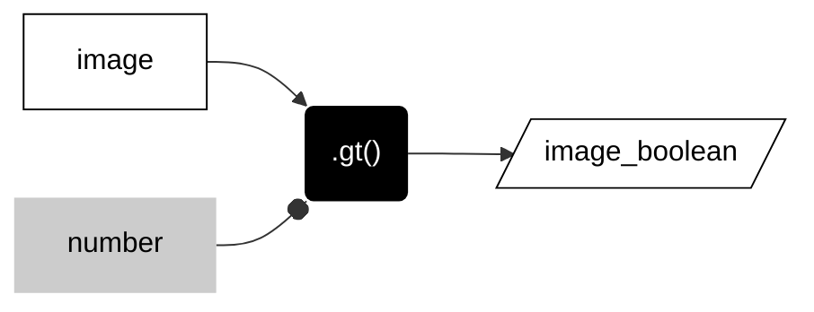
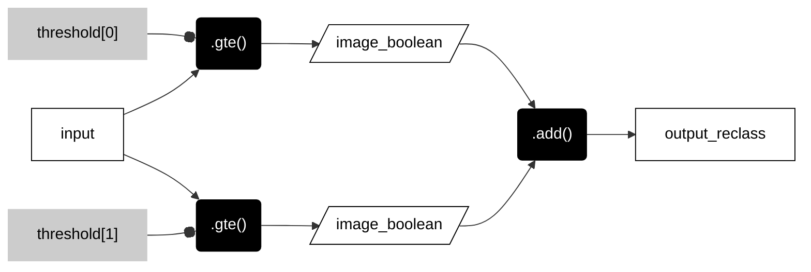
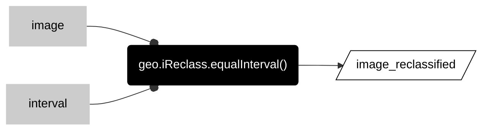
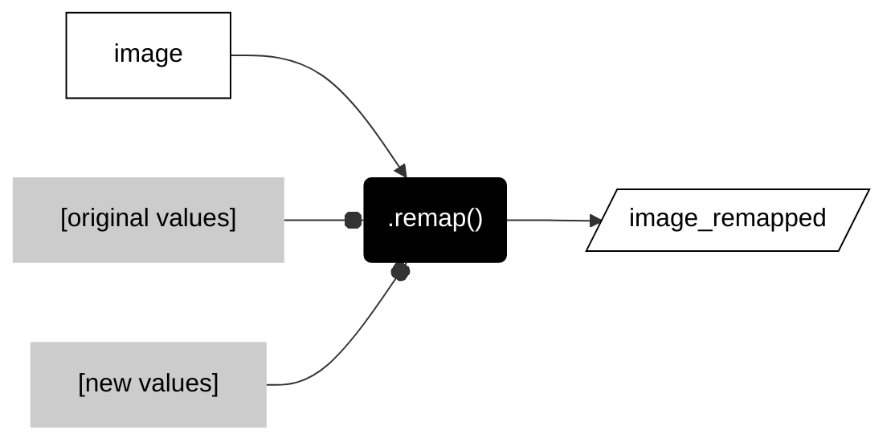

__PATTERNS__

# _**reclassify raster**_  

These methods purposefully reclassify the values in a raster. 

---  

## __Boolean raster__   

This pattern asks a true or false question about each value in the input raster and returns a 1 if true and 0 if false in the corresponding pixel of the output raster.   

---  


---  

<center>



</center>

---  

```js
var image_boolean = image.gt(number);  
```

---  

The table below lists some of the common methods to ask true or false questions about a raster. Each takes a number as an argument. Some technical folks will use the verb __threshold__ to describe methods that use greater than or less than methods to produce boolean rasters.  

---  

<center>

| METHOD                        | DESCRIPTION                                             |
| --:                           | :--                                                     |
|```.eq()```, ```.neq()```      | Equal to, not equal to                                  |    
|```.gt()``` ```.gte()```       | Greater than, greater than or equal to                 |   
|```.lt()``` ```.lte()```       | Less than, less than or equal to                 |   

</center>

---

## __Reclassify by defined breaks__

This method reclassifies values in the input raster based on user-defined breaks. This is useful when the input values represent a [__field model__](../three-t.md#conceptual-models) and when the intervals between breaks are not equal.  

The workflow can be a little confusing, but the basic idea is that you are using two or more threshold values to define a correspond set of boolean rasters that you then add together. Given two threshold values  

<center>



</center>

The figure below illustrates this workflow for a simple example that reclassifies an input raster (left) with two defined breaks: 0 and 2.  

---


---  

The code snippet below shows the pattern for EE with javascript. The first step isolates the band in the image to reclassify. The second step defines the breaks as a list of thresholds. The third step chains together the workflow illustrated in the flowchart and diagram above. Notice that the ```.gte()``` argument calls an item from the threshold list, where ```threshold[0]``` is the first item in the list and ```threshold[1]``` is the second item.   


```js
// ------------------------------------------------------------------------
//  Reclassify by defined breaks. 
// ------------------------------------------------------------------------

// Isolate band if necessary

var output = input.select("band_name");

// Define thresholds to reclassify a raster.

var thresholds = [0, 2];

// Make binaries for each threshold and add together. 

var output_reclassed = output.gte(thresholds[0])
  .add(output.gte(thresholds[1]))
;

```

The output raster will contain three values as follows:

| NEW VALUE | FROM OLD VALUE          | TO OLD VALUE        |
|:--:       | :--:                    | :--:                |
| 0         | min value in raster     | just less than 0    |
| 1         | 0                       | just less than 2  |  
| 2         | 2                       | max value in raster |  

---  

To add additional breaks, you will need to:  

1. add one or more values to the list of thresholds,  
2. add a corresponding number of ```.add(output.gte(thresholds[#]))``` lines to the routine.    

For example, the pattern below uses four preliminary thresholds that are often applied to NDVI images. The result will be an image with five classes that range from 0 to 4.  

```js

// ------------------------------------------------------------------------
//  Reclassify by defined breaks. 
// ------------------------------------------------------------------------

// Isolate band if necessary

var output = input.select("band_name");

// Define thresholds to reclassify a raster.

var thresholds = [0, 0.15, 0.33, 0.66];

// Make binaries for each threshold and add together. 

var output_reclassed = output.gte(thresholds[0])
  .add(output.gte(thresholds[1]))
  .add(output.gte(thresholds[2]))
  .add(output.gte(thresholds[3]))
;

```

---  

## __:earth_americas: Reclassify by equal intervals__  

This method assigns raster values into equal interval classes. The method divides each value in a raster by the interval number and then rounds down to the nearest integer (finds the floor). The integers in the output are __ordinal__ but arbitrary class numbers. 

---  


---  

<center>



</center>

---  

```js
var image_reclassified = geo.iReclass.equalInterval(image, interval);
```

---   

## __Remap old values to new values__

This method assigns integer values in the input raster to new integer values in the output raster based on transition rules defined by two lists. The first list defines the set of original values in the input raster. The second list defines the set of new values to be stored in the output raster. The order of the two lists determines the transition. The two lists must be the same length (have the same number of values).

---  


---  

<center>



</center>

---  

```js
var image_remapped = image.remap(
    [0,1,2,3,4],            // Original values
    [1,0,0,0,1]             // New values 
    )                       // Lengths of two lists must be equal.
  ;

```


---  

<p xmlns:cc="http://creativecommons.org/ns#" >This work is licensed under <a href="https://creativecommons.org/licenses/by-nc-sa/4.0/?ref=chooser-v1" target="_blank" rel="license noopener noreferrer" style="display:inline-block;">CC BY-NC-SA 4.0</a></p>