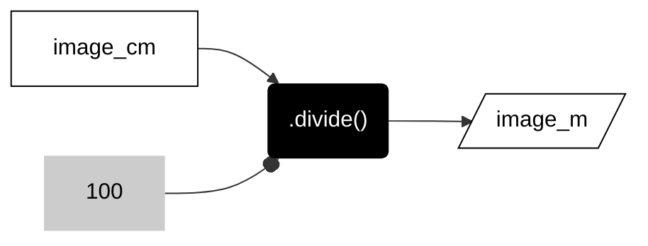
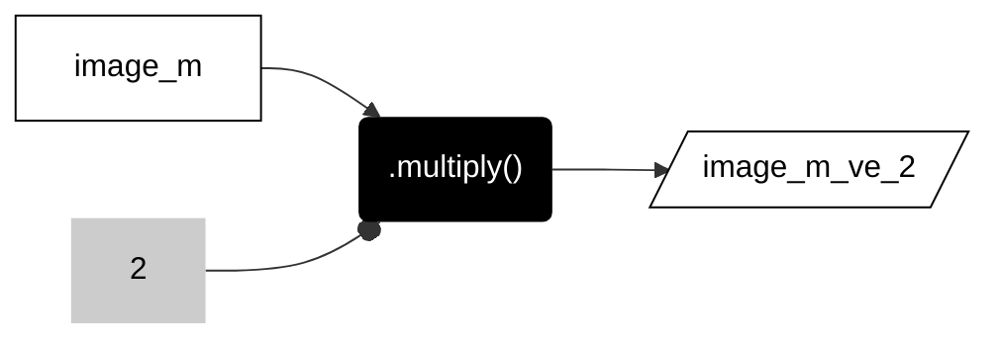

__PATTERNS__

# _**scalar operations**_

Uniformly change the values of all data in a raster object by adding, subtracting, multiplying, or dividing the raster by a constant.   

---  

## __add__  

Add each pixel value by constant. For example, pattern below adds by one.  

```js
var image_add_constant = image.add(1)

```

---  

## __subtract__

Subtract each pixel value by constant. For example, pattern below subtracts by 1.

```js
var image_subtract_constant = image.subtract(1)

```

---

## __multiply__

Multiply each pixel value by constant. For example, pattern below multiplies by 2.

```js
var image_multiply_constant = image.multiply(2)

```

---

## __divide__

Divide each pixel value by constant. For example, pattern below divides by 2.

```js
var image_divide_constant = image.divide(2)

```

---  

## __problem types__     

Here are a few types of problems that can be solved with scalar operations.  

### __change value units__ 

A common example is when you need to change the units of your data. For example, to change elevation data from centimeters to meters you divide all elevation values by the number 100 (scalar).   

---  

<center>



</center>

---  

```js
var image_m = image_cm.divide(100);
```

---  

The table below lists some common types of unit conversions and their pattern context.

---  

| CONTEXT                   | INPUT UNITS   | OUTPUT UNITS      | METHOD                        |
| :--                       |:--:           | :--:              | :--                           |
| TERRAIN                   | cm            | m                 | ```.divide(100)```            | 
| TERRAIN                   | ft            | m                 | ```.multiply(3.28084)```      |  
| SLOPE                     | degrees       | percent           | ```.divide(180).multiply(Math.PI).tan().multiply(100)```  |

---  

### __vertical exaggeration__ 

Another common example is when you want to apply vertical exaggeration to a terrain operation by multiplying the elevation values by a constant, usually called the __z-factor__. For example, by multiplying elevation by 2, you will exaggerate the terrain, making every location appear twice as high as it 'really' is. It is often helpful to exaggerate terrain when visualizing micro-topography at large scales or macro-topography at small scales. 

---  

<center>



</center>

---  

```js
var image_m_ve_2 = image_m.multiply(2);
```

---

<p xmlns:cc="http://creativecommons.org/ns#" >This work is licensed under <a href="https://creativecommons.org/licenses/by-nc-sa/4.0/?ref=chooser-v1" target="_blank" rel="license noopener noreferrer" style="display:inline-block;">CC BY-NC-SA 4.0</a></p>